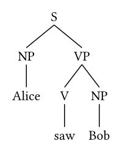
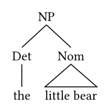
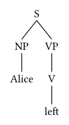
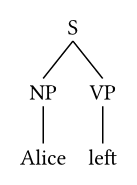
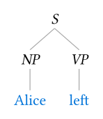
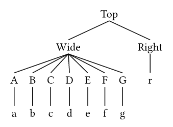
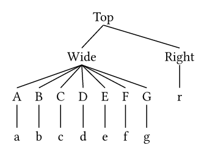

# Typst lingtree package

`lingtree` draws trees in Typst. It is almost a drop-in replacement
for [`syntree`](https://typst.app/universe/package/syntree) and supports the same
bracket and list notations for trees.

In contrast to `syntree`, `lingtree` first computes an abstract, presentation-neutral tree object
from the tree notation. This tree object is then rendered to Typst content.
This gives `lingtree` more freedom in laying out the tree. The key advantage for users
is that `lingtree` can center a parent above its children, rather than above the entire
subtree. This produces cleaner and more canonical layouts.


## Quick start

Import `lingtree` and write a tree in bracket notation:

```typ
#import "@preview/lingtree:0.1.0": syntree

#syntree[
  [S [NP Alice] [VP [V saw] [NP Bob]]]
]
```



Every pair of brackets creates one node. The first item is its label and the
remaining items are its children. A caret before a label replaces the branches
to that node's children with a roof:

```typ
#syntree[[NP [Det the] [^Nom little bear]]]
```



## Choose an input form

Use `syntree` for compact trees written inline. Use `listtree` when indentation
makes a larger tree easier to edit:

```typ
#import "@preview/lingtree:0.1.0": listtree

#listtree[
  - S
    - NP
      - Alice
    - VP
      - V
        - left
]
```



Both functions draw immediately. If your Typst code generates, inspects, or
rewrites trees, use `tree` to build neutral data and call `render` only after
the structure is complete. This is the one difference to the `syntree` API,
which does not require the `render` call.

```typ
#import "@preview/lingtree:0.1.0": tree, render

#let subject = tree([NP], tree([Alice]))
#let predicate = tree([VP], tree([left]))
#let sentence = tree([S], subject, predicate)

#render(sentence)
```



`tree` does not produce visible content. It returns a dictionary containing a
label, an ordered sequence of children, and the roof setting. This separation
lets a program transform the tree without depending on its eventual spacing or
style.

## Style and space a tree

The three drawing functions share the same layout options:

```typ
#syntree(
  terminal: (fill: blue),
  nonterminal: (style: "italic"),
  child-spacing: 1.5em,
  layer-spacing: 2em,
  stroke: 0.6pt + gray,
)[
  [S [NP Alice] [VP left]]
]
```



`terminal` styles leaf labels and `nonterminal` styles labels with children.
Each is a dictionary of parameters accepted by Typst's `text` function.
`child-spacing` controls the horizontal gap between sibling subtrees;
`layer-spacing` controls the vertical gap between a label and the next layer.

## Center parents above their children

`parent-align: "children"` is the default. It centers a parent between the root
positions of its outermost immediate children, so asymmetric descendant widths
do not pull the parent away from its children. Set `parent-align: "subtree"`
to center it over the complete bounding box of the child subtrees instead,
matching `syntree`.

<table>
  <thead>
    <tr>
      <th><code>"children"</code> (default)</th>
      <th><code>"subtree"</code></th>
    </tr>
  </thead>
  <tbody>
    <tr>
      <td><pre><code>#syntree(parent-align: "children")[
  [Top [Wide [A a] [B b] [C c] [D d] [E e] [F f] [G g]] [Right r]]
]</code></pre></td>
      <td><pre><code>#syntree(parent-align: "subtree")[
  [Top [Wide [A a] [B b] [C c] [D d] [E e] [F f] [G g]] [Right r]]
]</code></pre></td>
    </tr>
    <tr>
      <td></td>
      <td></td>
    </tr>
  </tbody>
</table>

## Documentation

- [API reference](docs/reference.md) lists every public function, option,
  default, return value, and relevant error.
- [Feature tour](examples/demo.typ) contains a complete document covering rich
  labels, roofs, programmatic construction, movement arrows, and alignment.
- [Rendered feature tour](output/pdf/lingtree-demo.pdf) shows its output.

The public API consists of `syntree`, `listtree`, `tree`, and `render`.
Implementation helpers are not exported.
